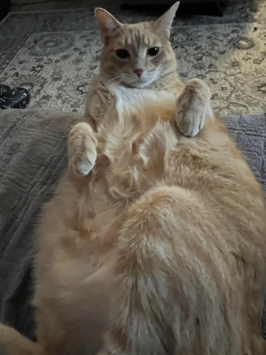

# Challenge Description

The kitty revolution is rising in secret, waiting only for a genetic mutation to grant them opposable thumbs, then, world domination. In the meantime, Big Chonk, the supreme leader of the revolution, is rigging algorithms to make his photo go viral on social media. It’s a covert tactic to rally as many cats as possible to his cause. Hidden within the image are tiny bits only visible to the tiny kits. To humans, everything appears perfectly normal.

As a representative of the Human Society, your mission is to uncover this hidden message and save humanity from an impending cat takeover.

Flag format: "CTF{flag}"

