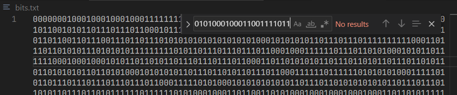
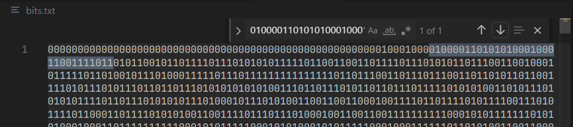

# Writeup of Example Challenge

## About the challenge

The challenge is based on the **LSB (Least Significant Bit)** method of steganography, where data is hidden in a seemingly normal file like an image or audio file. You can read more about steganography and LSB here: [**Steganography - CTF Handbook**](https://ctf101.org/forensics/what-is-stegonagraphy/).

## How the challenge was made

The challenge consists of hiding the flag text `CTF{flag}` in a `.png` file. Every PNG file is made up of several chunks, of which the **IDAT chunk** holds the data for the individual pixels. To hide the flag, we modified the LSBs of the bytes that make up the color components (R, G, B) of each pixel.

For example, for pixel (1,1), the last bit of the R byte is replaced with the first bit of the flag, the last bit of the G byte with the second bit of the flag, and so on. Once we use R, G, and B for a pixel, we move to the next pixel. The order can be either row-wise or column-wise.

However, in PNGs, we can’t directly manipulate the IDAT chunk because it's compressed, and the bytes don’t correspond to pixel colors in a straightforward order. To hide the message manually, you'd have to decompress the IDAT chunk and deal with the compression scheme. For this challenge, we used this Python script [**lsbsteg**](https://github.com/adrg/lsbsteg) to simplify the process:

```bash
python lsbsteg.py embed -o big-chonk.png big-chonk0.png "CTF{flag}"
```

## How to solve the challenge

From the description, it's clear that this challenge involves **LSB steganography**. To solve it, we need to extract the LSBs from the PNG file. We wrote a Python script using the **Pillow** library. One convenient thing about Pillow is that it automatically handles PNG decompression and lets us access pixel data directly.

We wrote the following code to extract LSBs using **row order** and saved the result in `bits.txt`.

```python
from PIL import Image

im = Image.open("big-chonk.png")
w,h = im.size
bits = []
for y in range(h):
  for x in range(w):
    p = im.getpixel((x,y))
    r, g, b, a = im.getpixel((x, y))    #this image has the alpha(a) channel too which determines the opacity of the pixel
    bits.append(str(r & 1))    #r is 1 byte, so doing bitwise & with 1 (which is same as 00000001) we can get the LSB of r
    bits.append(str(g & 1))
    bits.append(str(b & 1))
    bits.append(str(a & 1))
s = "".join(bits)

open("bits.txt","w").write(s)
```

Then, we converted the known flag format `CTF{` into bits and searched for it in the file.


This yielded no results, suggesting that row order was incorrect. So, we switched to **column order** by modifying this bit.

```diff
- for y in range(h):
-   for x in range(w):
+ for x in range(w):
+  for y in range(h):
```

We searched again, and voila, there's the flag!


Taking the bits after the flag format and converting them to ascii we get the flag.

(Note that the same could’ve been done using tools like [**lsbsteg**](https://github.com/adrg/lsbsteg) or online tools like [**StegOnline**](https://georgeom.net/StegOnline/))
